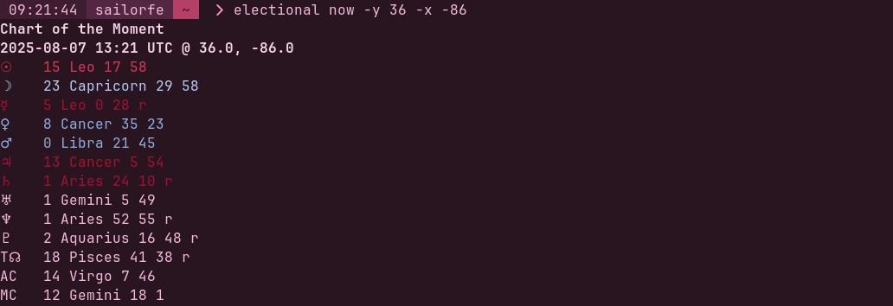
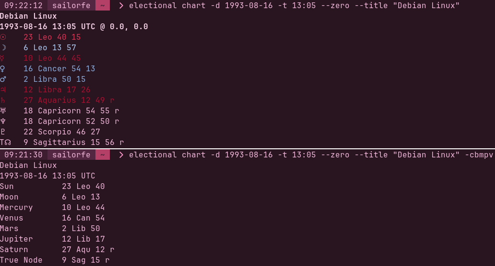

# chart

**chart** is a minimal, opinionated horoscope CLI designed with electional astrology and premodern revivalism in mind. `chart now` calculates the chart of the moment relative for your locale, while `chart cast` accepts input for specific dates like nativities and other past and future events.

pair with [ascendant](https://codeberg.org/sailorfe/ascendant) for an efficient scriptable clock 🤓

- [usage](#usage)
- [installation](#installation)
- [contributing](#contributing)
- [screenshots](#screenshots)
- [license](#license)

<a name="usage"></a>
## usage

```sh
$ chart now -h
usage: chart now [-h] [-y LAT] [-x LNG] [-s SHIFT] [--node {true,mean}] [-c] [-b] [-v] [-m] [-p]

options:
  -h, --help            show this help message and exit
  -y, --lat LAT         latitude
  -x, --lng LNG         longitude
  -s, --shift SHIFT     shift time forward or backward, e.g. 2h, -30m, 1.5d (default is hours)

display options:
  --node {true,mean}    choose lunar node calculation method
  -c, --classical       exclude Uranus through Pluto
  -b, --brief           print truncated placements, e.g. 21 Sco 2
  -v, --verbose         print planet names instead of glyphs
  -m, --no-color        disable ANSI colors
  -p, --no-coordinates  don't print coordinates
```

```sh
$ chart cast -h
usage: chart cast [-h] [--title TITLE] [-y LAT] [-x LNG] [-d DATE] [-t TIME] [--noon] [--zero] [--node {true,mean}] [-c] [-b] [-v] [-m] [-p]

options:
  -h, --help            show this help message and exit
  --title TITLE         e.g. <Your Name>, "Now", "Full Moon"
  -y, --lat LAT         latitude
  -x, --lng LNG         longitude
  -d, --date DATE       date of event, format: YYYY-MM-DD
  -t, --time TIME       time of event (24h), format: HH:MM
  --noon                use 12:00 UTC and print no angles
  --zero                use Null Island (0, 0) and print no angles

display options:
  --node {true,mean}    choose lunar node calculation method
  -c, --classical       exclude Uranus through Pluto
  -b, --brief           print truncated placements, e.g. 21 Sco 2
  -v, --verbose         print planet names instead of glyphs
  -m, --no-color        disable ANSI colors
  -p, --no-coordinates  don't print coordinates
```

<a name="installation"></a>
## installation

as of writing, this project hasn't been packaged for release because... i don't know how (yet). check back soon or clone this repo for the source!

<a name="contributing"></a>
## contributing

i welcome contributions!! this is my biggest python project so far. please help, please fork.

### ideas

- [ ] conversion from local time to UTC and vice versa
- [ ] alternate ANSI color schemes by sign triplicity or quadruplicity
- [x] ~~option to print coordinates~~
- [ ] pseudo "wheel" text output option in the style of Astrolog

<a name="screenshots"></a>
## screenshots





<a name="license"></a>
## license

per the original [swiss ephemeris](https://www.astro.com/swisseph/swephinfo_e.htm), this software is licensed under the AGPL.
