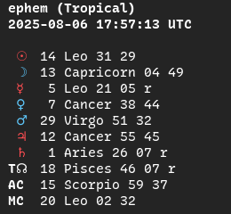
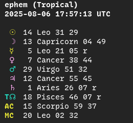
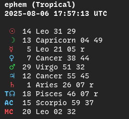
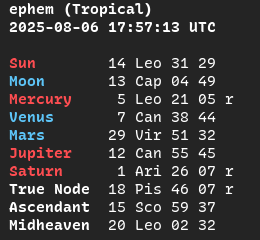
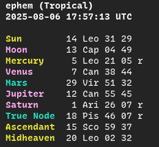
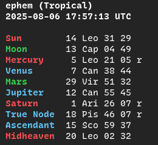

# Display & Configuration

## The configuration file

The `ephem` config lives at `~/.config/ephem/ephem.toml`. If you open it in a text editor, it might look something like:

```toml
# ephem.toml
[display]
no-geo = true
classical = true
ascii = true

[location]
lat = -36.25
lng = 142.416667

[zodiac]
offset = 0
```

While running `ephem --show-config` prints the same information as:

```
Location defaults:
  Latitude:  -36.25
  Longitude: 142.416667

Zodiac system:
  System: Sidereal — Fagan-Bradley (index 0)

Display preferences:
  Hide coordinates: enabled
  Classical planets only: enabled
  ASCII mode (no Unicode glyphs): enabled
```

`--save-config` tracks changes to single fields declared through optional flags, but not necessarily their omission, e.g. you accidentally configured a sidereal offset and can't change it back to tropical. In such cases, you may want to delete the old `ephem.toml` before making major changes:

```sh
$ rm ~/.config/ephem/ephem.toml
```

## Configuration options

You already got a taste of `--save-config` when you [set your location defaults](./10-getting-started.md), but let's take a look at all the configuration options available for the three calculation commands.

**`now`, `cast` and `cal`**:
- `-o N/--offset N`: sidereal ayanamsa offset or None for tropical. Run `--list-offsets` to see all 47 available ayanamsas and find the corresponding index `N`.
- `-a/--ascii`: use ASCII text instead of Unicode glyphs. This can smooth over terminal incompatibilities, like strangely formatted `cal` tables.
 
**`now` and `cast only`**:
- `-t/--theme {sect,mode,element}`: choose colorscheme by planetary sect, or sign mode or element. Defaults to sect.
- `-c/--no-color`: disable ANSI colors.
- `-c/--classical`: exclude Uranus through Pluto.
- `-n/--node {true,mean}`: choose lunar node calculation method.
- `-A/--no-angles`: don't print Ascendant or Midheaven.
- `-G/--no-geo`: don't print coordinates.

### Display: format and color

#### Unicode vs ASCII output

By default, ephem prints planetary glyphs and full sign names for `now` and `cast`, and sign glyphs for `cal`. Appending `-a/--ascii` changes the format to full planet names and abbreviated signs:

```
# default format
ephem (Tropical)
2025-08-06 17:57:13 UTC

 ☉  14 Leo 31 28
 ☽  13 Capricorn 04 42
 ☿   5 Leo 21 05 r
 ♀   7 Cancer 38 44
 ♂  29 Virgo 51 32
 ♃  12 Cancer 55 45
 ♄   1 Aries 26 07 r
 ♅   1 Gemini 04 37
 ♆   1 Aries 53 44 r
 ♇   2 Aquarius 17 54 r
T☊  18 Pisces 46 07 r
AC  15 Scorpio 56 49
MC  19 Leo 59 12
```

```
# --ascii flag
ephem (Tropical)
2025-08-06 17:57:13 UTC

Sun        14 Leo 31 28
Moon       13 Cap 04 42
Mercury     5 Leo 21 05 r
Venus       7 Can 38 44
Mars       29 Vir 51 32
Jupiter    12 Can 55 45
Saturn      1 Ari 26 07 r
Uranus      1 Gem 04 37
Neptune     1 Ari 53 44 r
Pluto       2 Aqu 17 54 r
True Node  18 Pis 46 07 r
Ascendant  15 Sco 56 49
Midheaven  19 Leo 59 12
```

#### Themes

| Sect                                      | Mode                                      | Element                                   |
| ----------------------------------------- | ----------------------------------------- | ----------------------------------------- |
|                |                |          |
|         |         |      |

- `--theme sect`, the default, mimics Astrodienst's Hellenistic wheel style of coloring the visible planets by sect, including Mercury, whose sect is relative to the Sun.
- `--theme mode` colors the planets by the modality of their sign. This is a useful way to look for squares and oppositions.
- `--theme element` colors the planets by the element of their sign. This is a useful way to look for trines.

### Suppressing geodata

Two flags, `-G/--no-geo` and `-A/--no-angles`, serve to hold back information from the output. You may consider using them in the following situations:

- `-G/--no-geo`: You run `ephem now` and don't want to doxx yourself if you copy or screenshot the output.
- `-A/--no-angles` for hypothetical charts with a known time but no known coordinates. Since `ephem cast` falls back to your location defaults, you might want to suppress both coordinates and angles with `-AG`.

Note: `ephem cast` with a date but no time suppresses angles by default. The reason date + time + no coordinates falls back is in case you're electing an event for your current location.
